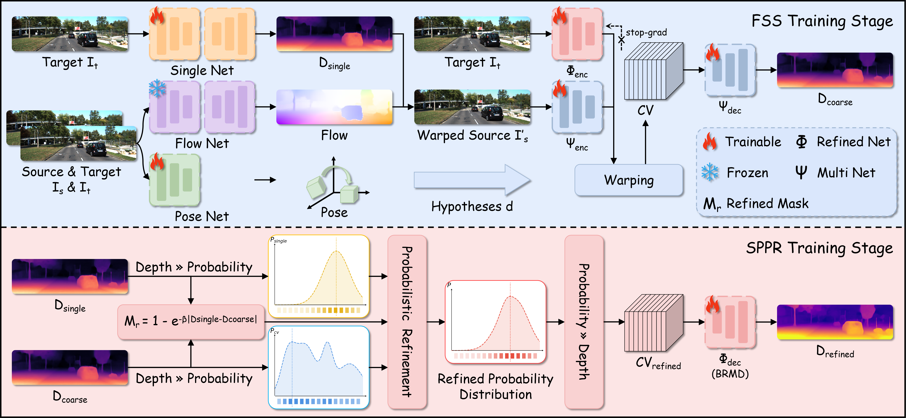

# OGSRDepth
Rethinking Cost Volumes in Dynamic Regions: Optical Flow Guidance and Single-Frame Refinement for Self-Supervised Monocular Depth Estimation

The code for this work will be released upon acceptance.

